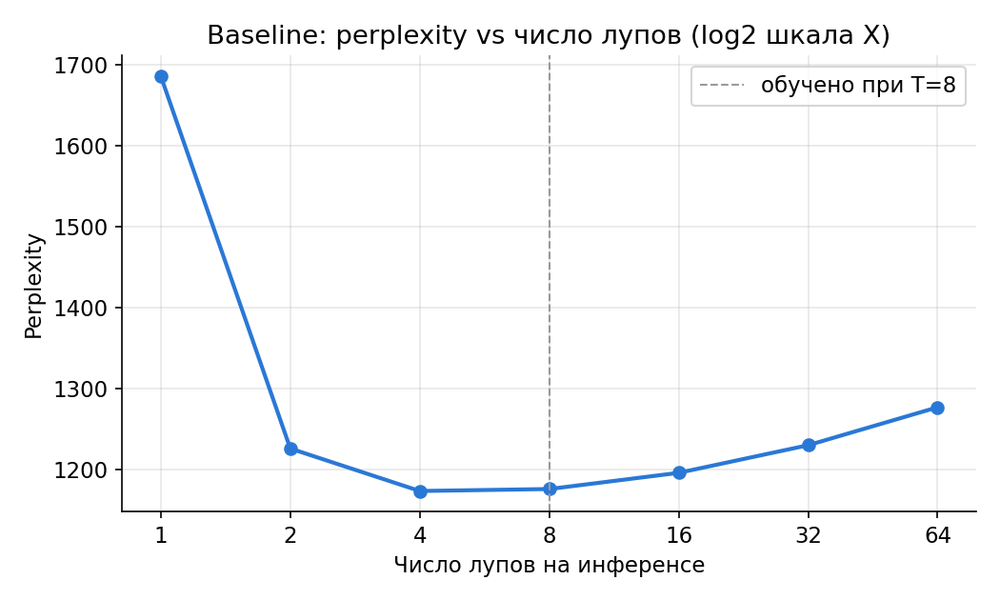
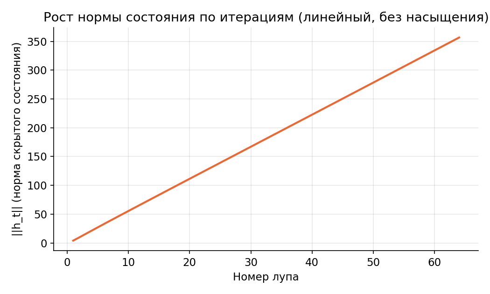
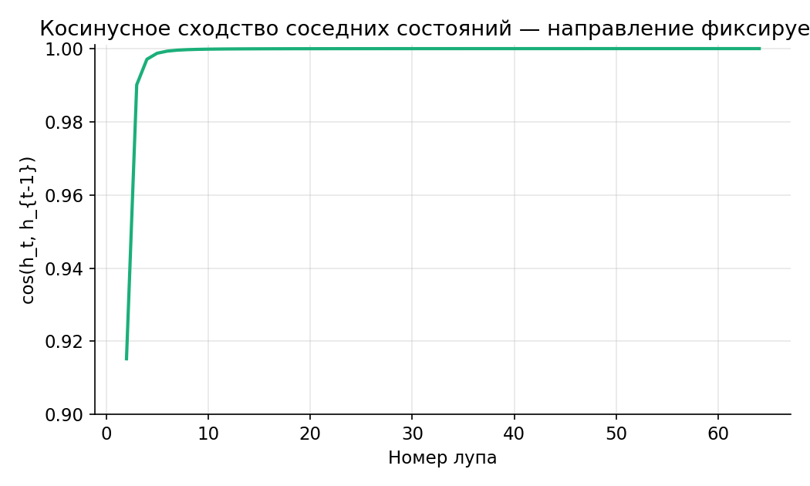
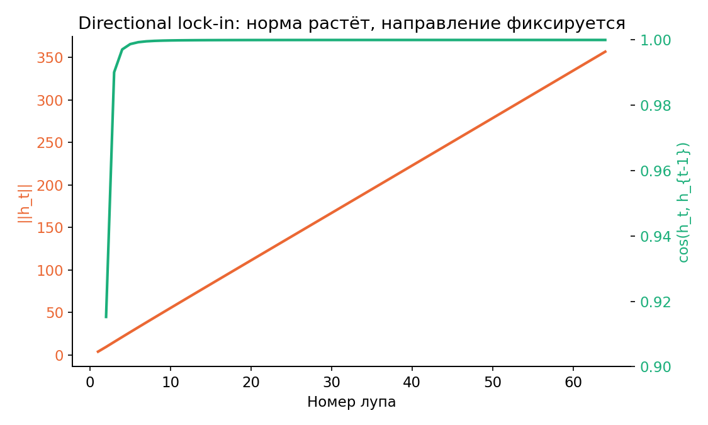

# Шаг 1 — baseline looped-трансформер: наблюдение сатурации

Модель: 3.47M параметров, `d_model=256`, `n_heads=4`, `n_kv_heads=2`,
`n_layers_per_block=2`, `vocab_size=8000`. Обучена с фиксированным `T=8`
(без input injection, loop-index conditioning или других модификаций —
чистый weight-tied looped-блок).

## 1. Кривая качества: perplexity vs число лупов на инференсе



| T | perplexity |
|---|---|
| 1 | 1685.5 |
| 2 | 1225.9 |
| 4 | **1173.4** (минимум) |
| 8 | 1175.9 (обучено здесь) |
| 16 | 1195.9 |
| 32 | 1230.0 |
| 64 | 1276.8 |

Минимум качества — на T=4, T=8 практически идентичен (разница в пределах
шума). После T=8 (там, где модель обучалась) качество **монотонно и
плавно ухудшается**. Классическая сатурация: дополнительные лупы сверх
обученного бюджета не просто бесполезны, а начинают вредить.

## 2. Диагностика: рост нормы состояния



Норма скрытого состояния `||h_t||` растёт **линейно** на всём диапазоне
T=1..64 (прирост стабильно ~5.6-5.8 за итерацию), без признаков плато.
Это **не** классическая сходимость к неподвижной точке DEQ-типа (где
`Block(h) = h` и норма должна выходить на плато) — состояние продолжает
меняться по величине.

## 3. Диагностика: косинусное сходство соседних состояний



При этом направление состояния `cos(h_t, h_{t-1})` быстро (к 5-му лупу)
приближается к 0.999, а к 20-му — к 0.9999+. **Направление** состояния
фиксируется, даже пока его **длина** продолжает расти.

## 4. Совмещённая картина



## Интерпретация

Норма скрытого состояния растет линейно на всем диапазоне, при этом
косинусное расстояние сходится к 1 с увеличением итераций. По сути мы
выходим не на плато, а модель просто добавляет вектор все более и
более похожий на изначальный, так как мы используем

```python
x = x + self.attn(self.attn_norm(x), cos, sin, attn_mask)
x = x + self.mlp(self.mlp_norm(x))
```

без какой либо нормализации. В подтверждении этому что норма растет +-
линейно. И независимо от роста нормы, мы получаем что блок постенно
сводит все к одному направлению. Он после нескольких шагов начианет
действовать как и раньше, так как у него нет знания о том какой шаг он
сейчас делает. Из а роста нормы может деградировать состояние на
больших итерация, так как сам блок выходит за пределы своего обучения.

## Гипотезы для проверки в Шаге 2

1. **Depth-scaled residual / gating** — домножать вклад блока на
   затухающий коэффициент (например ~1/√t), чтобы ограничить рост
   нормы состояния. Не даст выйти за рамки того, что видел блок при
   обучении, что возможно позволит выйти на плато качества, а не
   деградацию
2. **Loop-index conditioning** — дать блоку дешёвый сигнал о номере
   итерации (FiLM-модуляция от эмбеддинга/синусоиды индекса), чтобы
   он мог вести себя по-разному на разных стадиях, а не сходиться к
   одному направлению.
3. **Диагностический тест перед архитектурными изменениями**: взять
   текущий чекпоинт и на инференсе искусственно перенормировать `h`
   перед финальной проекцией (привести норму к тому же значению, что
   было при T=8 во время обучения) — если качество на T=64
   восстанавливается, подтверждает, что деградация вызвана именно
   ростом нормы, а не потерей информации по направлению.
4. **Trajectory-aware блок** — Вместо того чтобы просто сообщать блоку,
   о том на какой он сейчас итерации можно говорить, что он делал
   раньше и как он это делал. Это обобщает гиптозы 1 и 2 и позволит
   блоку память:
   - **Momentum/velocity**: передавать в блок дельту предыдушего шага.
     Дает блоку информации о скорости, а не только позиции
   - **Trajectory-conditioned gating**: вместо `h_next = h_t +
     block(h_t)` — взвешенное обновление
     `h_next = (1-g)*h_t + g*block(h_t)`, где гейт `g` — маленькая
     сеть, принимающая на вход в том числе
     `cos(delta_{t-1}, proposal)`. Гипотеза в том, что если правки по
     направлению совпадают то возможно мы зафиксировали направление, а
     гейт может научиться приглушать ее, чтобы во первых органичивать
     норму, а во вторых дает блоку информацию о прошлом, которую
     baseline не может получить из `h_t`
   - И самое тяжеловесное, это маленькое отдельное состояние
     контроллер, который будет содержать краткую сводку истории, и она
     будет обощаться на любое Т, а не только то что мы обучили.

## Как воспроизвести

```bash
python scripts/train_tokenizer.py --vocab_size 8000 --n_docs 20000

python src/train.py --max_tokens 500000 --n_loops_train 8 \
    --out_dir checkpoints/smoke_test --log_every 5 --val_every 50

python src/train.py --max_tokens 3000000 --n_loops_train 8 \
    --out_dir checkpoints/baseline_T8_fast \
    --val_every 200 --log_every 20

python src/eval.py --checkpoint checkpoints/baseline_T8_fast/final.pt \
    --loop_counts 1,2,4,8,16,32,64
```

Графики в этом отчёте сгенерированы из `baseline_T8_curve.json` скриптом
`scripts/make_plots.py` (см. соответствующий раздел репозитория).