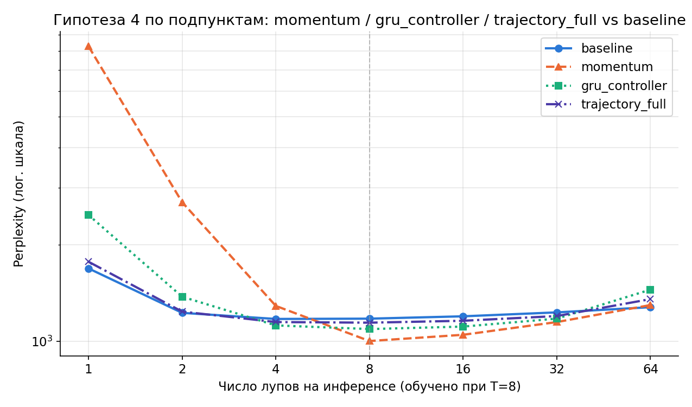
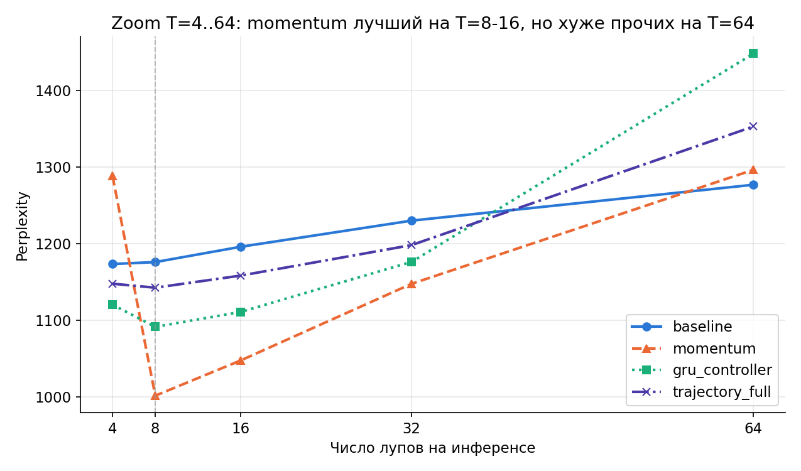

# Гипотеза 4 по подпунктам: momentum vs gru_controller vs комбинация

Три изолированных подпункта гипотезы 4 (REPORT.md) плюс их комбинация,
сравнены с baseline на одинаковом бюджете (3M токенов, T=8 при обучении).

- **momentum** — только дельта предыдущего шага на входе блока, без gate,
  без памяти
- **gru_controller** — только GRU-память истории + FiLM на входе, без
  отдельного output-gate
- **trajectory_full** — все три подпункта вместе (momentum + gate +
  GRU-память), как в изначальной "полной" реализации

## Графики

## Числа

| T | baseline | momentum | gru_controller | trajectory_full |
|---|---|---|---|---|
| 1 | 1685.5 | **8281.6** ⚠ | 2472.5 | 1768.2 |
| 2 | 1225.9 | 2708.5 | 1376.0 | 1236.7 |
| 4 | 1173.4 | 1288.3 | 1120.4 | 1147.7 |
| 8 (обучено) | 1175.9 | **1001.6** | 1091.4 | 1142.5 |
| 16 | 1195.9 | **1047.6** | 1110.9 | 1158.3 |
| 32 | 1230.0 | 1147.6 | 1176.2 | 1198.1 |
| 64 | 1276.8 | 1296.3 | 1447.8 | 1352.8 |

## Главный результат: подпункты НЕ аддитивны

**Изолированный `momentum`** — лучший результат из всех протестированных
вариантов на T=8 (1001.6, на 15% лучше baseline) и на T=16 (1047.6).
**Комбинация всех трёх** (`trajectory_full`) на этих же T заметно хуже
(1142.5 и 1158.3) — то есть добавление gate и GRU-памяти поверх
momentum не улучшает, а *ухудшает* результат относительно одного лишь
momentum. Совместное обучение трёх механизмов, судя по всему, либо
конкурирует за один и тот же полезный сигнал, либо усложняет
оптимизационный ландшафт за одинаковый бюджет обучения.

## Слабое место momentum: катастрофа на T=1

`momentum` даёт ppl=8281.6 на T=1 — хуже случайного угадывания (ppl
случайного = размер словаря = 8000). Причина: при T=1 `delta_prev`
инициализируется нулём, блок получает немодулированный вход — как в
baseline. Но веса блока обучались **преимущественно** видя
модулированный (ненулевой momentum) вход на шагах 2+, и, видимо,
специализировались под многошаговый режим ценой способности работать
"с нуля". `trajectory_full` и `gru_controller` тоже деградируют на T=1
(1768 и 2473 соответственно), но не так катастрофически — вероятно,
потому что gate/FiLM у них частично компенсируют отсутствие контекста.

## `gru_controller` — самый ровный, нигде не худший и нигде не лучший

Второе место на T=8 (1091.4), умеренная (не катастрофическая)
просадка на T=1 (2472.5), терпимая деградация на T=64 (1447.8).
Не выигрывает ни в одной точке, но и не проваливается экстремально —
самый "безопасный" из трёх подпунктов по отдельности.

