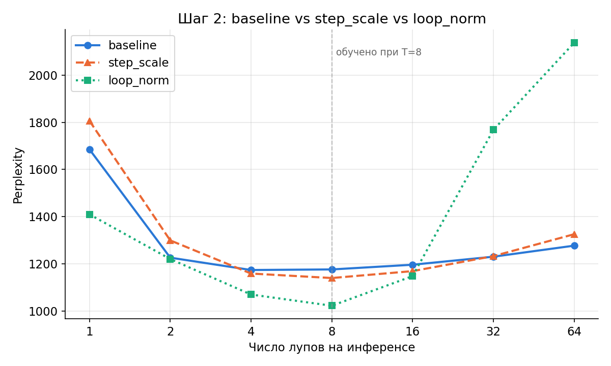
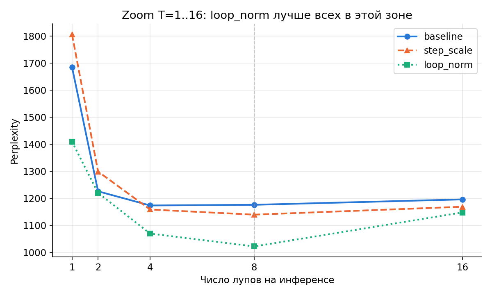

# Шаг 2 — сравнение механизмов против сатурации

Три конфигурации, обученные на одинаковом бюджете (3M токенов, T=8,
иначе идентичные гиперпараметры), оценены на T = 1, 2, 4, 8, 16, 32, 64.

- **baseline** — без модификаций (см. Шаг 1)
- **step_scale** — обучаемый `scale(t)`, зависящий ТОЛЬКО от номера итерации
  (синусоидальное кодирование + MLP, без истории/состояния)
- **loop_norm** — структурная RMSNorm residual stream после каждого лупа,
  не зависящая от t вообще

(Четвёртый вариант, `trajectory` — полная гипотеза 4 с GRU-памятью истории
— обучается отдельно, результат будет добавлен по готовности.)

## Сравнение всех трёх



## Zoom на T=1..16 — где loop_norm выигрывает



## Числа

| T | baseline | step_scale | loop_norm |
|---|---|---|---|
| 1 | 1685.5 | 1806.5 | 1409.6 |
| 2 | 1225.9 | 1299.1 | 1219.9 |
| 4 | 1173.5 | 1158.5 | **1069.4** |
| 8 (обучено) | 1175.9 | 1139.4 | **1021.8** |
| 16 | 1195.9 | 1168.7 | **1147.6** |
| 32 | 1230.0 | 1232.5 | 1768.3 |
| 64 | 1276.8 | 1325.4 | 2137.9 |

Минимум ppl по каждому варианту: baseline 1173.5 (T=4), step_scale 1139.4
(T=8), **loop_norm 1021.8 (T=8)** — loop_norm даёт ~13% улучшение
относительно baseline ровно на обученном T.

## Главный, неожиданный результат

`loop_norm` — лучший вариант в зоне T=1..16 (примерно до двойного
обученного T), но резко проигрывает на T=32/64: на T=64 он почти в 1.7
раза хуже baseline (2138 против 1277), хотя изначально ожидалось обратное
— структурный механизм, не зависящий от t, должен был лучше
экстраполироваться, а не хуже.

### Интерпретация: потеря неявного сигнала глубины

У baseline норма состояния растёт с каждым лупом (см. Шаг 1) — это,
похоже, случайно давало модели слабый, но реальный сигнал "насколько
глубоко я нахожусь" (больше норма ⇒ позже итерация). `loop_norm` жёстко
фиксирует норму с первого лупа — и тем самым уничтожает этот неявный
сигнал. Модель лишается любого способа отличить луп 8 от лупа 40. При
T=8 (где она обучалась) это не мешает и даже помогает (фиксированный
масштаб проще для самого предсказания), но при экстраполяции на T=64
модель применяет одну и ту же нормализованную операцию вслепую — и,
судя по всему, направленческий дрейф (`cos_sim → 1`, см. Шаг 1)
накапливается в этом режиме разрушительнее, чем при естественном росте
нормы у baseline.

`step_scale` ведёт себя ровно так, как и предполагалось при его введении:
небольшой выигрыш возле T=8, но уже на T=32 паритет с baseline, а на
T=64 — хуже baseline. Экстраполяция вслепую (сеть никогда не видела
градиент для t>7) подтверждена именно тем провалом, который и ожидался.

### Методологическая оговорка

`fixed_point_diagnostics` в JSON-результатах прогоняет **сырой**
`model.block()` напрямую, не применяя сам механизм (`loop_norm`/
`step_scale`) — это диагностика поведения необработанного блока, а не
прямое наблюдение эффекта механизма в реальном forward pass. Числа
отличаются между вариантами, потому что веса блока обучились по-разному
под каждый механизм, но не показывают, что происходит с нормой *внутри*
`loop_norm`-режима на больших T. Для честной диагностики в `eval.py`
добавлены `get_loop_norm_trace`/`get_learned_step_scales` — эти поля
нужно перепроверить, что они попадают в свежие результаты.

## Вывод на данный момент

Ни один из двух протестированных механизмов не даёт "бесплатного"
решения: `step_scale` почти не помогает и не вредит, `loop_norm` даёт
сильный выигрыш в узком окне вокруг T=8, но ценой катастрофы на
больших T. Это усиливает мотивацию для `trajectory` (гипотеза 4) —
единственного варианта с явной памятью, потенциально способного
восстановить потерянный сигнал глубины через накопленную историю,
вместо того чтобы полагаться на побочный эффект растущей нормы.

## Как воспроизвести

```bash
for name in baseline step_scale loop_norm trajectory; do
  # обучение — флаги --use_step_scale / --use_loop_norm / --use_trajectory
  # соответственно; baseline без флагов
  python src/eval.py --checkpoint checkpoints/$name/final.pt \
      --tokenizer_dir tokenizer --loop_counts 1,2,4,8,16,32,64 \
      --out_json results/${name}_curve.json
done
python scripts/make_step2_plots.py
```
